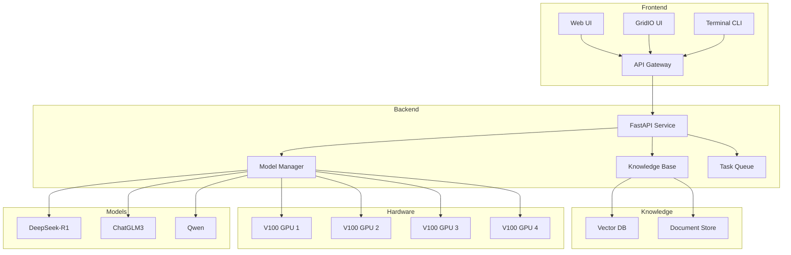
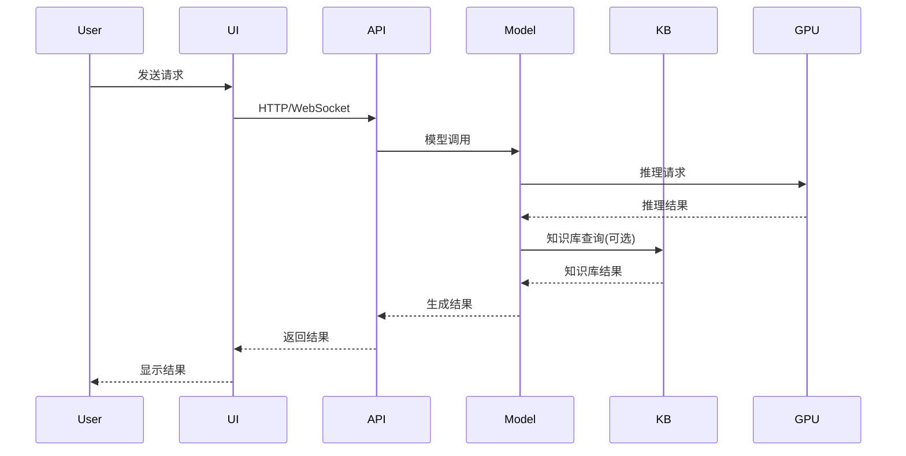

# 系统架构

## 整体架构

## 数据流图

## 组件说明

### 1. 前端组件
- Web UI: 基于Vue.js的完整界面
- GridIO UI: 基于GridIO的简易界面
- Terminal CLI: 命令行交互工具

### 2. 后端服务
- FastAPI Service: RESTful API服务
- Model Manager: 模型管理和调度
- Knowledge Base: 知识库管理
- Task Queue: 任务队列管理

### 3. 模型支持
- DeepSeek-R1: 7B/13B/33B版本
- ChatGLM3: 6B/32B版本
- Qwen: 7B/14B/72B版本

### 4. 知识库组件
- Vector DB: 向量数据库
- Document Store: 文档存储

### 5. 硬件资源
- 4x V100 GPU: 用于模型推理 